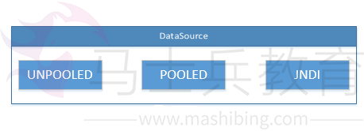
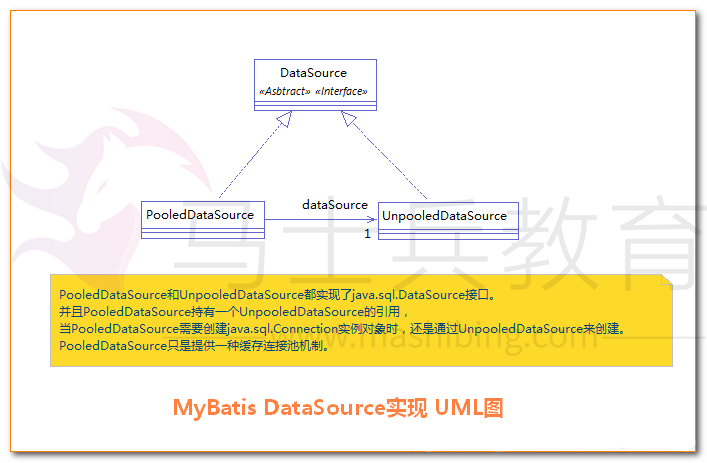
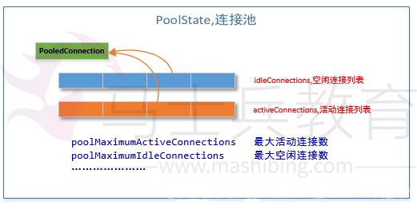

# 《深入理解mybatis原理》 Mybatis数据源与连接池


 对于ORM框架而言，数据源的组织是一个非常重要的一部分，这直接影响到框架的性能问题。本文将通过对MyBatis框架的数据源结构进行详尽的分析，并且深入解析MyBatis的连接池。

  本文首先会讲述MyBatis的数据源的分类，然后会介绍数据源是如何加载和使用的。紧接着将分类介绍UNPOOLED、POOLED和JNDI类型的数据源组织；期间我们会重点讲解POOLED类型的数据源和其实现的连接池原理。


## 一、MyBatis数据源DataSource分类

> MyBatis数据源实现是在以下四个包中：
>
> ```
> org.apache.ibatis.datasource
> 
> org.apache.ibatis.datasource.jndi
> 
> org.apache.ibatis.datasource.pooled
> 
> org.apache.ibatis.datasource.unpooled
> ```
>
> MyBatis把数据源DataSource分为三种：
>
> ​    ž UNPOOLED   不使用连接池的数据源
>
> ​    ž POOLED   使用连接池的数据源
>
> ​    ž JNDI      使用JNDI实现的数据源
>
> 即：
>
> 
>
> 相应地，MyBatis内部分别定义了实现了java.sql.DataSource接口的UnpooledDataSource，PooledDataSource类来表示UNPOOLED、POOLED类型的数据源。 
>
> 
>
> 对于JNDI类型的数据源DataSource，则是通过JNDI上下文中取值。

## **二、数据源DataSource的创建过程**

>  **MyBatis\**数据源\**\**DataSource\**\**对象的创建发生在\**\**MyBatis\**\**初始化的过程中。\****下面让我们一步步地了解MyBatis是如何创建数据源DataSource的。
>
> 在mybatis的XML配置文件中，使用<dataSource>元素来配置数据源：
>
> 
>
> \1. MyBatis在初始化时，解析此文件，根据<dataSource>的type属性来创建相应类型的的数据源DataSource，即：
>
> > - type=”POOLED” ：MyBatis会创建PooledDataSource实例
> > - type=”UNPOOLED” ：MyBatis会创建UnpooledDataSource实例
> > - type=”JNDI”   ：MyBatis会从JNDI服务上查找DataSource实例，然后返回使用
>
> 
>
> \2. 顺便说一下，MyBatis是通过工厂模式来创建数据源DataSource对象的，MyBatis定义了抽象的工厂接口*:**org.apache.ibatis.datasource.DataSourceFactory***,通过其getDataSource()方法返回数据源DataSource：
>
> 定义如下：
>
> ```java
> public interface DataSourceFactory {
>  
>   void setProperties(Properties props);
>   //生产DataSource
>   DataSource getDataSource();
> }
> ```
>
> 上述三种不同类型的type，则有对应的以下dataSource工厂：
>
> - POOLED     PooledDataSourceFactory
> - UNPOOLED   UnpooledDataSourceFactory
> - JNDI      JndiDataSourceFactory
>
> 
>
>   其类图如下所示：

> \3. MyBatis创建了DataSource实例后，会将其放到Configuration对象内的Environment对象中， 供以后使用。

## **三、 DataSource什么时候创建Connection对象** 

> 当我们需要创建SqlSession对象并需要执行SQL语句时，这时候MyBatis才会去调用dataSource对象来创建java.sql.Connection对象。也就是说，java.sql.Connection对象的创建一直延迟到执行SQL语句的时候。
>
> 比如，我们有如下方法执行一个简单的SQL语句：
>
> 
>
> ```java
> String resource = "mybatis-config.xml";
> InputStream inputStream = Resources.getResourceAsStream(resource);
> SqlSessionFactory sqlSessionFactory = new SqlSessionFactoryBuilder().build(inputStream);
> SqlSession sqlSession = sqlSessionFactory.openSession();
> sqlSession.selectList("SELECT * FROM STUDENTS");
> ```
>
> 前4句都不会导致java.sql.Connection对象的创建，只有当第5句sqlSession.selectList("SELECT * FROM STUDENTS")，才会触发MyBatis在底层执行下面这个方法来创建java.sql.Connection对象：
>
> 
>
> 
>
> ```java
> protected void openConnection() throws SQLException {
>     if (log.isDebugEnabled()) {
>       log.debug("Opening JDBC Connection");
>     }
>     connection = dataSource.getConnection();
>     if (level != null) {
>       connection.setTransactionIsolation(level.getLevel());
>     }
>     setDesiredAutoCommit(autoCommmit);
>   }
> ```
>
> 
>
> 而对于DataSource的UNPOOLED的类型的实现-UnpooledDataSource是怎样实现getConnection()方法的呢？请看下一节。

## **四、不使用连接池的UnpooledDataSource**

> 当 <dataSource>的type属性被配置成了”UNPOOLED”，MyBatis首先会实例化一个UnpooledDataSourceFactory工厂实例，然后通过.getDataSource()方法返回一个UnpooledDataSource实例对象引用，我们假定为dataSource。
>
> 使用UnpooledDataSource的getConnection(),每调用一次就会产生一个新的Connection实例对象。
>
> UnPooledDataSource的getConnection()方法实现如下：
>
> 
>
> ```java
> /*
> UnpooledDataSource的getConnection()实现
> */
> public Connection getConnection() throws SQLException
> {
>     return doGetConnection(username, password);
> }
>  
> private Connection doGetConnection(String username, String password) throws SQLException
> {
>     //封装username和password成properties
>     Properties props = new Properties();
>     if (driverProperties != null)
>     {
>         props.putAll(driverProperties);
>     }
>     if (username != null)
>     {
>         props.setProperty("user", username);
>     }
>     if (password != null)
>     {
>         props.setProperty("password", password);
>     }
>     return doGetConnection(props);
> }
>  
> /*
>  *  获取数据连接
>  */
> private Connection doGetConnection(Properties properties) throws SQLException
> {
>     //1.初始化驱动
>     initializeDriver();
>     //2.从DriverManager中获取连接，获取新的Connection对象
>     Connection connection = DriverManager.getConnection(url, properties);
>     //3.配置connection属性
>     configureConnection(connection);
>     return connection;
> }
> ```
>
> 
>
> 如上代码所示，UnpooledDataSource会做以下事情：
>
> \1. **初始化驱动：**  判断driver驱动是否已经加载到内存中，如果还没有加载，则会动态地加载driver类，并实例化一个Driver对象，使用DriverManager.registerDriver()方法将其注册到内存中，以供后续使用。
>
> \2. **创建Connection对象：**  使用DriverManager.getConnection()方法创建连接。
>
> \3. **配置Connection对象：**  设置是否自动提交autoCommit和隔离级别isolationLevel。
>
> **4. 返回Connection对象。**
>
>  
>
> 上述的序列图如下所示：
>
> 
>
> 
>
> 总结：从上述的代码中可以看到，***\*我们每调用一次\**\**getConnection()\**\**方法，都会通过\**\**DriverManager.getConnection()\**\**返回新的\**\**java.sql.Connection\**\**实例。\****

## **五、为什么要使用连接池？**

> **1. 创建一个java.sql.Connection实例对象的代价**
>
> 首先让我们来看一下创建一个java.sql.Connection对象的资源消耗。我们通过连接Oracle数据库，创建创建Connection对象，来看创建一个Connection对象、执行SQL语句各消耗多长时间。代码如下：
>
> 
>
> ```java
> public static void main(String[] args) throws Exception
> {
>  
>     String sql = "select * from hr.employees where employee_id < ? and employee_id >= ?";
>     PreparedStatement st = null;
>     ResultSet rs = null;
>  
>     long beforeTimeOffset = -1L; //创建Connection对象前时间
>     long afterTimeOffset = -1L; //创建Connection对象后时间
>     long executeTimeOffset = -1L; //创建Connection对象后时间
>  
>     Connection con = null;
>     Class.forName("oracle.jdbc.driver.OracleDriver");
>  
>     beforeTimeOffset = new Date().getTime();
>     System.out.println("before:\t" + beforeTimeOffset);
>  
>     con = DriverManager.getConnection("jdbc:oracle:thin:@127.0.0.1:1521:xe", "louluan", "123456");
>  
>     afterTimeOffset = new Date().getTime();
>     System.out.println("after:\t\t" + afterTimeOffset);
>     System.out.println("Create Costs:\t\t" + (afterTimeOffset - beforeTimeOffset) + " ms");
>  
>     st = con.prepareStatement(sql);
>     //设置参数
>     st.setInt(1, 101);
>     st.setInt(2, 0);
>     //查询，得出结果集
>     rs = st.executeQuery();
>     executeTimeOffset = new Date().getTime();
>     System.out.println("Exec Costs:\t\t" + (executeTimeOffset - afterTimeOffset) + " ms");
>  
> }
> ```
>
> 上述程序在我笔记本上的执行结果为：
>
> 
>
> 
>
> 
>
> 从此结果可以清楚地看出，创建一个Connection对象，用了**250 毫秒**；而执行SQL的时间用了**170毫秒**。
>
> 创建一个Connection对象用了250毫秒！这个时间对计算机来说可以说是一个**非常奢侈**的！
>
> 这仅仅是一个Connection对象就有这么大的代价，设想一下另外一种情况：如果我们在Web应用程序中，为用户的每一个请求就操作一次数据库，当有10000个在线用户并发操作的话，对计算机而言，仅仅创建Connection对象不包括做业务的时间就要损耗10000×250ms= 250 0000 ms = 2500 s = 41.6667 min,竟然要***\*41\****分钟！！！如果对高用户群体使用这样的系统，简直就是开玩笑！
>
> **2. 问题分析：**
>
>  
>
> 创建一个java.sql.Connection对象的代价是如此巨大，是因为创建一个Connection对象的过程，在底层就相当于和数据库建立的通信连接，在建立通信连接的过程，消耗了这么多的时间，而往往我们建立连接后（即创建Connection对象后），就执行一个简单的SQL语句，然后就要抛弃掉，这是一个非常大的资源浪费！
>
>  
>
> **3.解决方案:**
>
> 对于需要频繁地跟数据库交互的应用程序，可以在创建了Connection对象，并操作完数据库后，可以不释放掉资源，而是将它放到内存中，当下次需要操作数据库时，可以直接从内存中取出Connection对象，不需要再创建了，这样就极大地节省了创建Connection对象的资源消耗。由于内存也是有限和宝贵的，这又对我们对内存中的Connection对象怎么有效地维护提出了很高的要求。我们将在内存中存放Connection对象的容器称之为 连接池（Connection Pool）。下面让我们来看一下MyBatis的线程池是怎样实现的。

## **六、使用了连接池的PooledDataSource**

> 同样地，我们也是使用PooledDataSource的getConnection()方法来返回Connection对象。现在让我们看一下它的基本原理：
>
>  PooledDataSource将java.sql.Connection对象包裹成PooledConnection对象放到了PoolState类型的容器中维护。 MyBatis将连接池中的PooledConnection分为两种状态： 空闲状态（idle）和活动状态(active)，这两种状态的PooledConnection对象分别被存储到PoolState容器内的**idleConnections**和**activeConnections**两个List集合中：
>
> **idleConnections**:空闲(idle)状态PooledConnection对象被放置到此集合中，表示当前闲置的没有被使用的PooledConnection集合，调用PooledDataSource的getConnection()方法时，会优先从此集合中取PooledConnection对象。当用完一个java.sql.Connection对象时，MyBatis会将其包裹成PooledConnection对象放到此集合中。
>
> **activeConnections**:活动(active)状态的PooledConnection对象被放置到名为activeConnections的ArrayList中，表示当前正在被使用的PooledConnection集合，调用PooledDataSource的getConnection()方法时，会优先从idleConnections集合中取PooledConnection对象,如果没有，则看此集合是否已满，如果未满，PooledDataSource会创建出一个PooledConnection，添加到此集合中，并返回。
>
>  
>
> PoolState连接池的大致结构如下所示：
>
> 
>
> 
>
> **6.1 获取java.sql.Connection对象的过程**
>
>  
>
> 下面让我们看一下PooledDataSource 的getConnection()方法获取Connection对象的实现：
>
> 
>
> ```java
>  public Connection getConnection() throws SQLException {
>     return popConnection(dataSource.getUsername(), dataSource.getPassword()).getProxyConnection();
>   }
>  
>   public Connection getConnection(String username, String password) throws SQLException {
>     return popConnection(username, password).getProxyConnection();
>   }
> ```
>
> 
>
> 上述的popConnection()方法，会从连接池中返回一个可用的PooledConnection对象，然后再调用getProxyConnection()方法最终返回Conection对象。（至于为什么会有getProxyConnection(),请关注下一节）
>
>  
>
> 现在让我们看一下popConnection()方法到底做了什么：
>
> \1. 先看是否有空闲(idle)状态下的PooledConnection对象，如果有，就直接返回一个可用的PooledConnection对象；否则进行第2步。
>
> \2. 查看活动状态的PooledConnection池activeConnections是否已满；如果没有满，则创建一个新的PooledConnection对象，然后放到activeConnections池中，然后返回此PooledConnection对象；否则进行第三步；
>
> \3. 看最先进入activeConnections池中的PooledConnection对象是否已经过期：如果已经过期，从activeConnections池中移除此对象，然后创建一个新的PooledConnection对象，添加到activeConnections中，然后将此对象返回；否则进行第4步。
>
> \4. 线程等待，循环2步
>
> ```java
> /*
>  * 传递一个用户名和密码，从连接池中返回可用的PooledConnection
>  */
> private PooledConnection popConnection(String username, String password) throws SQLException
> {
>     boolean countedWait = false;
>     PooledConnection conn = null;
>     long t = System.currentTimeMillis();
>     int localBadConnectionCount = 0;
>  
>     while (conn == null)
>     {
>         synchronized (state)
>         {
>             if (state.idleConnections.size() > 0)
>             {
>                 // 连接池中有空闲连接，取出第一个
>                 conn = state.idleConnections.remove(0);
>                 if (log.isDebugEnabled())
>                 {
>                     log.debug("Checked out connection " + conn.getRealHashCode() + " from pool.");
>                 }
>             }
>             else
>             {
>                 // 连接池中没有空闲连接，则取当前正在使用的连接数小于最大限定值，
>                 if (state.activeConnections.size() < poolMaximumActiveConnections)
>                 {
>                     // 创建一个新的connection对象
>                     conn = new PooledConnection(dataSource.getConnection(), this);
>                     @SuppressWarnings("unused")
>                     //used in logging, if enabled
>                     Connection realConn = conn.getRealConnection();
>                     if (log.isDebugEnabled())
>                     {
>                         log.debug("Created connection " + conn.getRealHashCode() + ".");
>                     }
>                 }
>                 else
>                 {
>                     // Cannot create new connection 当活动连接池已满，不能创建时，取出活动连接池的第一个，即最先进入连接池的PooledConnection对象
>                     // 计算它的校验时间，如果校验时间大于连接池规定的最大校验时间，则认为它已经过期了，利用这个PoolConnection内部的realConnection重新生成一个PooledConnection
>                     //
>                     PooledConnection oldestActiveConnection = state.activeConnections.get(0);
>                     long longestCheckoutTime = oldestActiveConnection.getCheckoutTime();
>                     if (longestCheckoutTime > poolMaximumCheckoutTime)
>                     {
>                         // Can claim overdue connection
>                         state.claimedOverdueConnectionCount++;
>                         state.accumulatedCheckoutTimeOfOverdueConnections += longestCheckoutTime;
>                         state.accumulatedCheckoutTime += longestCheckoutTime;
>                         state.activeConnections.remove(oldestActiveConnection);
>                         if (!oldestActiveConnection.getRealConnection().getAutoCommit())
>                         {
>                             oldestActiveConnection.getRealConnection().rollback();
>                         }
>                         conn = new PooledConnection(oldestActiveConnection.getRealConnection(), this);
>                         oldestActiveConnection.invalidate();
>                         if (log.isDebugEnabled())
>                         {
>                             log.debug("Claimed overdue connection " + conn.getRealHashCode() + ".");
>                         }
>                     }
>                     else
>                     {
>  
>                         //如果不能释放，则必须等待有
>                         // Must wait
>                         try
>                         {
>                             if (!countedWait)
>                             {
>                                 state.hadToWaitCount++;
>                                 countedWait = true;
>                             }
>                             if (log.isDebugEnabled())
>                             {
>                                 log.debug("Waiting as long as " + poolTimeToWait + " milliseconds for connection.");
>                             }
>                             long wt = System.currentTimeMillis();
>                             state.wait(poolTimeToWait);
>                             state.accumulatedWaitTime += System.currentTimeMillis() - wt;
>                         }
>                         catch (InterruptedException e)
>                         {
>                             break;
>                         }
>                     }
>                 }
>             }
>  
>             //如果获取PooledConnection成功，则更新其信息
>  
>             if (conn != null)
>             {
>                 if (conn.isValid())
>                 {
>                     if (!conn.getRealConnection().getAutoCommit())
>                     {
>                         conn.getRealConnection().rollback();
>                     }
>                     conn.setConnectionTypeCode(assembleConnectionTypeCode(dataSource.getUrl(), username, password));
>                     conn.setCheckoutTimestamp(System.currentTimeMillis());
>                     conn.setLastUsedTimestamp(System.currentTimeMillis());
>                     state.activeConnections.add(conn);
>                     state.requestCount++;
>                     state.accumulatedRequestTime += System.currentTimeMillis() - t;
>                 }
>                 else
>                 {
>                     if (log.isDebugEnabled())
>                     {
>                         log.debug("A bad connection (" + conn.getRealHashCode() + ") was returned from the pool, getting another connection.");
>                     }
>                     state.badConnectionCount++;
>                     localBadConnectionCount++;
>                     conn = null;
>                     if (localBadConnectionCount > (poolMaximumIdleConnections + 3))
>                     {
>                         if (log.isDebugEnabled())
>                         {
>                             log.debug("PooledDataSource: Could not get a good connection to the database.");
>                         }
>                         throw new SQLException("PooledDataSource: Could not get a good connection to the database.");
>                     }
>                 }
>             }
>         }
>  
>     }
>  
>     if (conn == null)
>     {
>         if (log.isDebugEnabled())
>         {
>             log.debug("PooledDataSource: Unknown severe error condition.  The connection pool returned a null connection.");
>         }
>         throw new SQLException("PooledDataSource: Unknown severe error condition.  The connection pool returned a null connection.");
>     }
>  
>     return conn;
> }
> ```
>
> 对应的处理流程图如下所示：
>
> 
>
> 如上所示,对于PooledDataSource的getConnection()方法内，先是调用类PooledDataSource的popConnection()方法返回了一个PooledConnection对象，然后调用了PooledConnection的getProxyConnection()来返回Connection对象。
>
> 
>
> **6.2java.sql.Connection对象的回收**
>
> ​    **当我们的程序中使用完Connection对象时，如果不使用数据库连接池，我们一般会调用 connection.close()方法，关闭connection连接，释放资源。如下所示：**
>
> 
>
> ```java
> private void test() throws ClassNotFoundException, SQLException
> {
>     String sql = "select * from hr.employees where employee_id < ? and employee_id >= ?";
>     PreparedStatement st = null;
>     ResultSet rs = null;
>  
>     Connection con = null;
>     Class.forName("oracle.jdbc.driver.OracleDriver");
>     try
>     {
>         con = DriverManager.getConnection("jdbc:oracle:thin:@127.0.0.1:1521:xe", "louluan", "123456");
>         st = con.prepareStatement(sql);
>         //设置参数
>         st.setInt(1, 101);
>         st.setInt(2, 0);
>         //查询，得出结果集
>         rs = st.executeQuery();
>         //取数据，省略
>         //关闭，释放资源
>         con.close();
>     }
>     catch (SQLException e)
>     {
>         con.close();
>         e.printStackTrace();
>     }
> }
> ```
>
> 
>
> **调用过close()方法的Connection对象所持有的资源会被全部释放掉，Connection对象也就不能再使用。**
>
> **那么，如果我们使用了连接池，我们在用完了Connection对象时，需要将它放在连接池中，该怎样做呢？**
>
> 可能大家第一个在脑海里闪现出来的想法就是：我在应该调用con.close()方法的时候，不调用close()f方法，将其换成将Connection对象放到连接池容器中的代码！
>
> 好，我们将上述的想法实现，首先定义一个简易连接池Pool，然后将上面的代码改写：
>
> 
>
> ```java
> package com.foo.jdbc;
>  
> import java.sql.Connection;
> import java.sql.DriverManager;
> import java.sql.SQLException;
> import java.util.Vector;
>  
> /**
>  * 
>  * 一个线程安全的简易连接池实现，此连接池是单例的
>  *  putConnection()将Connection添加到连接池中
>  *  getConnection()返回一个Connection对象
>  */
> public class Pool {
>  
>     private static Vector<Connection> pool = new Vector<Connection>();
>     
>     private static int MAX_CONNECTION =100;
>     
>     private static String DRIVER="oracle.jdbc.driver.OracleDriver";
>     private static String URL = "jdbc:oracle:thin:@127.0.0.1:1521:xe";
>     private static String USERNAME = "louluan";
>     private static String PASSWROD = "123456";
>     
>     static {
>         try {
>             Class.forName(DRIVER);
>         } catch (ClassNotFoundException e) {
>             e.printStackTrace();
>         }
>     }
>     
>     /**
>      * 将一个Connection对象放置到连接池中 
>      */
>     public static  void putConnection(Connection connection){
>         
>         synchronized(pool)
>         {
>             if(pool.size()<MAX_CONNECTION)
>             {
>                 pool.add(connection);       
>             }
>         }
>     }
>     
>     
>     /**
>      * 返回一个Connection对象，如果连接池内有元素，则pop出第一个元素；
>      * 如果连接池Pool中没有元素，则创建一个connection对象，然后添加到pool中
>      * @return Connection
>      */
>     public static Connection getConnection(){
>         Connection connection = null;
>         synchronized(pool)
>         {
>             if(pool.size()>0)
>             {
>                 connection = pool.get(0);
>                 pool.remove(0);
>             }
>             else
>             {
>                 connection = createConnection();
>                 pool.add(connection);
>             }
>         }
>         return connection;
>     }
>     
>     /**
>      * 创建一个新的Connection对象
>      */
>     private static Connection createConnection()
>     {
>         Connection connection = null;
>         try {
>             connection = DriverManager.getConnection(URL, USERNAME,PASSWROD);
>         } catch (SQLException e) {
>             e.printStackTrace();
>         }
>         return connection;
>     }
>     
> }
> package com.foo.jdbc;
> 
> import java.sql.Connection;
> import java.sql.DriverManager;
> import java.sql.PreparedStatement;
> import java.sql.ResultSet;
> import java.sql.SQLException;
> import java.util.Vector;
>  
> public class PoolTest
> {
>  
>     private void test() throws ClassNotFoundException, SQLException
>     {
>         String sql = "select * from hr.employees where employee_id < ? and employee_id >= ?";
>         PreparedStatement st = null;
>         ResultSet rs = null;
>         Connection con = null;
>         Class.forName("oracle.jdbc.driver.OracleDriver");
>         try
>         {
>             con = DriverManager.getConnection("jdbc:oracle:thin:@127.0.0.1:1521:xe", "louluan", "123456");
>             st = con.prepareStatement(sql);
>             //设置参数
>             st.setInt(1, 101);
>             st.setInt(2, 0);
>             //查询，得出结果集
>             rs = st.executeQuery();
>             //取数据，省略
>             //将不再使用的Connection对象放到连接池中，供以后使用
>             Pool.putConnection(con);
>         }
>         catch (SQLException e)
>         {
>             e.printStackTrace();
>         }
>     }
> }
> ```
>
> 
>
> 上述的代码就是将我们使用过的Connection对象放到Pool连接池中，我们需要Connection对象的话，只需要使用Pool.getConnection()方法从里面取即可。
>
> 是的,上述的代码完全可以实现此能力，不过有一个很不优雅的实现：**就是我们需要手动地将Connection对象放到Pool连接池中，这是一个很傻的实现方式。这也和一般使用Connection对象的方式不一样：一般使用Connection的方式是使用完后，然后调用.close()方法释放资源。**
>
> 为了和一般的使用Conneciton对象的方式保持一致，我们希望当Connection使用完后，调用.close()方法，而实际上Connection资源并没有被释放，而实际上被添加到了连接池中。这样可以做到吗？答案是可以。上述的要求从另外一个角度来描述就是：能否提供一种机制，让我们知道Connection对象调用了什么方法，从而根据不同的方法自定义相应的处理机制。恰好代理机制就可以完成上述要求.
>
>  
>
> **怎样实现Connection对象调用了close()方法，而实际是将其添加到连接池中**
>
> 这是要使用代理模式，为真正的Connection对象创建一个代理对象，代理对象所有的方法都是调用相应的真正Connection对象的方法实现。当代理对象执行close()方法时，要特殊处理，不调用真正Connection对象的close()方法，而是将Connection对象添加到连接池中。
>
>  
>
> MyBatis的PooledDataSource的PoolState内部维护的对象是PooledConnection类型的对象，而PooledConnection则是对真正的数据库连接java.sql.Connection实例对象的包裹器。
>
> PooledConnection对象内持有一个真正的数据库连接java.sql.Connection实例对象和一个java.sql.Connection的代理：
>
> 其部分定义如下：
>
> ```javascript
> class PooledConnection implements InvocationHandler {
>   
>   //......
>   //所创建它的datasource引用
>   private PooledDataSource dataSource;
>   //真正的Connection对象
>   private Connection realConnection;
>   //代理自己的代理Connection
>   private Connection proxyConnection;
>   
>   //......
> }
> ```
>
> PooledConenction
>
>  实现了
>
>  InvocationHandler
>
>  接口，并且，
>
>  proxyConnection
>
>  对象也是根据这个它来生成的代理对象：
>
> ```java
> public PooledConnection(Connection connection, PooledDataSource dataSource) {
>     this.hashCode = connection.hashCode();
>     this.realConnection = connection;
>     this.dataSource = dataSource;
>     this.createdTimestamp = System.currentTimeMillis();
>     this.lastUsedTimestamp = System.currentTimeMillis();
>     this.valid = true;
>     this.proxyConnection = (Connection) Proxy.newProxyInstance(Connection.class.getClassLoader(), IFACES, this);
>   }
> ```
>
> 
>
> 实际上，我们调用PooledDataSource的getConnection()方法返回的就是这个proxyConnection对象。
>
> 当我们调用此proxyConnection对象上的任何方法时，都会调用PooledConnection对象内invoke()方法。
>
> 让我们看一下PooledConnection类中的invoke()方法定义：
>
> 
>
> ```java
> public Object invoke(Object proxy, Method method, Object[] args) throws Throwable {
>     String methodName = method.getName();
>     //当调用关闭的时候，回收此Connection到PooledDataSource中
>     if (CLOSE.hashCode() == methodName.hashCode() && CLOSE.equals(methodName)) {
>       dataSource.pushConnection(this);
>       return null;
>     } else {
>       try {
>         if (!Object.class.equals(method.getDeclaringClass())) {
>           checkConnection();
>         }
>         return method.invoke(realConnection, args);
>       } catch (Throwable t) {
>         throw ExceptionUtil.unwrapThrowable(t);
>       }
>     }
>   }
> ```
>
> 
>
> 从上述代码可以看到，当我们使用了pooledDataSource.getConnection()返回的Connection对象的close()方法时，不会调用真正Connection的close()方法，而是将此Connection对象放到连接池中。

## 七、JNDI类型的数据源DataSource

> 对于JNDI类型的数据源DataSource的获取就比较简单，MyBatis定义了一个JndiDataSourceFactory工厂来创建通过JNDI形式生成的DataSource。
>
> 下面让我们看一下JndiDataSourceFactory的关键代码：
>
> 
>
> ```java
> if (properties.containsKey(INITIAL_CONTEXT)
>         && properties.containsKey(DATA_SOURCE))
> {
>     //从JNDI上下文中找到DataSource并返回
>     Context ctx = (Context) initCtx.lookup(properties.getProperty(INITIAL_CONTEXT));
>     dataSource = (DataSource) ctx.lookup(properties.getProperty(DATA_SOURCE));
> }
> else if (properties.containsKey(DATA_SOURCE))
> {
>     // //从JNDI上下文中找到DataSource并返回
>     dataSource = (DataSource) initCtx.lookup(properties.getProperty(DATA_SOURCE));
> }
> ```

