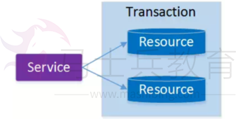
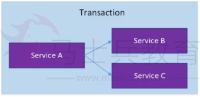
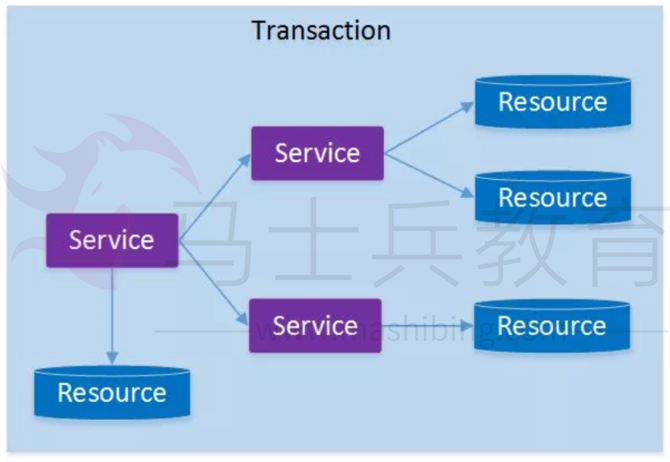
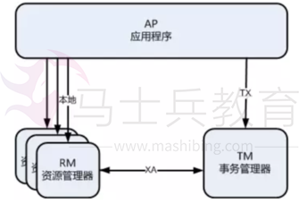
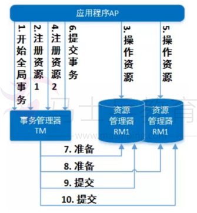
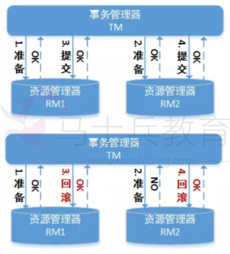
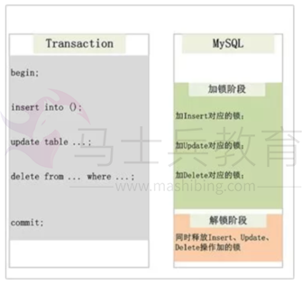
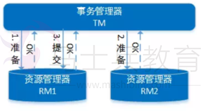
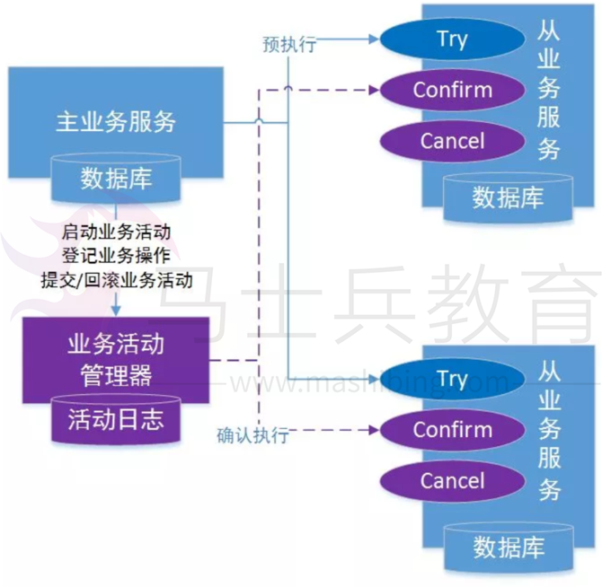

# 一篇文章带你学习分布式事务

分布式事务是企业集成中的一个技术难点，也是每一个分布式系统架构中都会涉及到的一个东西，特别是在这几年越来越火的微服务架构中，几乎可以说是无法避免，本文就围绕分布式事务各方面与大家进行介绍。

　　**一. 事务**

　　**1.1 什么是事务**

　　数据库事务(简称：事务，Transaction)是指数据库执行过程中的一个逻辑单位，由一个有限的数据库操作序列构成。

　　事务拥有以下四个特性，习惯上被称为ACID特性：

　　原子性(Atomicity)：事务作为一个整体被执行，包含在其中的对数据库的操作要么全部被执行，要么都不执行。

　　一致性(Consistency)：事务应确保数据库的状态从一个一致状态转变为另一个一致状态。一致状态是指数据库中的数据应满足完整性约束。除此之外，一致性还有另外一层语义，就是事务的中间状态不能被观察到(这层语义也有说应该属于原子性)。

　　隔离性(Isolation)：多个事务并发执行时，一个事务的执行不应影响其他事务的执行，如同只有这一个操作在被数据库所执行一样。

　　持久性(Durability)：已被提交的事务对数据库的修改应该永久保存在数据库中。在事务结束时，此操作将不可逆转。

　　**1.2 本地事务**

　　起初，事务仅限于对单一数据库资源的访问控制：

　　架构服务化以后，事务的概念延伸到了服务中。倘若将一个单一的服务操作作为一个事务，那么整个服务操作只能涉及一个单一的数据库资源：

　　这类基于单个服务单一数据库资源访问的事务，被称为本地事务(Local Transaction)。

　　**二. 分布式事务应用架构**

　　本地事务主要限制在单个会话内，不涉及多个数据库资源。但是在基于SOA(Service-Oriented Architecture，面向服务架构)的分布式应用环境下，越来越多的应用要求对多个数据库资源，多个服务的访问都能纳入到同一个事务当中，分布式事务应运而生。

　　最早的分布式事务应用架构很简单，不涉及服务间的访问调用，仅仅是服务内操作涉及到对多个数据库资源的访问。

　　当一个服务操作访问不同的数据库资源，又希望对它们的访问具有事务特性时，就需要采用分布式事务来协调所有的事务参与者。

　　对于上面介绍的分布式事务应用架构，尽管一个服务操作会访问多个数据库资源，但是毕竟整个事务还是控制在单一服务的内部。如果一个服务操作需要调用另外一个服务，这时的事务就需要跨越多个服务了。在这种情况下，起始于某个服务的事务在调用另外一个服务的时候，需要以某种机制流转到另外一个服务，从而使被调用的服务访问的资源也自动加入到该事务当中来。下图反映了这样一个跨越多个服务的分布式事务：

　　如果将上面这两种场景(一个服务可以调用多个数据库资源，也可以调用其他服务)结合在一起，对此进行延伸，整个分布式事务的参与者将会组成如下图所示的树形拓扑结构。在一个跨服务的分布式事务中，事务的发起者和提交均系同一个，它可以是整个调用的客户端，也可以是客户端最先调用的那个服务。

　　较之基于单一数据库资源访问的本地事务，分布式事务的应用架构更为复杂。在不同的分布式应用架构下，实现一个分布式事务要考虑的问题并不完全一样，比如对多资源的协调、事务的跨服务传播等，实现机制也是复杂多变。尽管有这么多工程细节需要考虑，但分布式事务最核心的还是其 ACID 特性。因此，想要了解一个分布式事务，就先从了解它是怎么实现事务 ACID 特性开始。

　　下文将从两个最常见的分布式事务模型入手，着重分析分布式事务的基础共通点，即如何保证分布式事务的 ACID 特性。

　　**三. 常见分布式事务模型 ACID 实现分析**

　　**3.1 X/Open XA 协议**

　　最早的分布式事务模型是 X/Open 国际联盟提出的 X/Open Distributed Transaction Processing(DTP)模型，也就是大家常说的 X/Open XA 协议，简称XA 协议。

　　DTP 模型中包含一个全局事务管理器(TM，Transaction Manager)和多个资源管理器(RM，Resource Manager)。全局事务管理器负责管理全局事务状态与参与的资源，协同资源一起提交或回滚;资源管理器则负责具体的资源操作。

　　XA 协议描述了 TM 与 RM 之间的接口，允许多个资源在同一分布式事务中访问。

　　基于 DTP 模型的分布式事务流程大致如下：

　　1.应用程序(AP，Application)向 TM 申请开始一个全局事务。

　　2.针对要操作的 RM，AP 会先向 TM 注册(TM 负责记录 AP 操作过哪些 RM，即分支事务)，TM 通过 XA 接口函数通知相应 RM 开启分布式事务的子事务，接着 AP 就可以对该 RM 管理的资源进行操作。

　　3.当 AP 对所有 RM 操作完毕后，AP 根据执行情况通知 TM 提交或回滚该全局事务，TM 通过 XA 接口函数通知各 RM 完成操作。TM 会先要求各个 RM 做预提交，所有 RM 返回成功后，再要求各 RM 做正式提交，XA 协议要求，一旦 RM 预提交成功，则后续的正式提交也必须能成功;如果任意一个 RM 预提交失败，则 TM 通知各 RM 回滚。

　　4.所有 RM 提交或回滚完成后，全局事务结束。

　　**3.1.1 原子性**

　　XA 协议使用 2PC(Two Phase Commit，两阶段提交)原子提交协议来保证分布式事务原子性。

　　两阶段提交是指将提交过程分为两个阶段，即准备阶段(投票阶段)和提交阶段(执行阶段)：

　　准备阶段：

　　TM 向每个 RM 发送准备消息。如果 RM 的本地事务操作执行成功，则返回成功;如果 RM 的本地事务操作执行失败，则返回失败。

　　提交阶段

　　如果 TM 收到了所有 RM 回复的成功消息，则向每个 RM 发送提交消息;否则发送回滚消息;RM 根据 TM 的指令执行提交或者回滚本地事务操作，释放所有事务处理过程中使用的锁资源。

　　**3.1.2 隔离性**

　　XA 协议中没有描述如何实现分布式事务的隔离性，但是 XA 协议要求DTP 模型中的每个 RM 都要实现本地事务，也就是说，基于 XA 协议实现的分布式事务的隔离性是由每个 RM 本地事务的隔离性来保证的，当一个分布式事务的所有子事务都是隔离的，那么这个分布式事务天然的就实现了隔离性。

　　以 MySQL 来举例，MySQL 使用 2PL(Two-Phase Locking，两阶段锁)机制来控制本地事务的并发，保证隔离性。2PL 与 2PC 类似，也是将锁操作分为加锁和解锁两个阶段，并且保证两个阶段完全不相交。加锁阶段，只加锁，不放锁。解锁阶段，只放锁，不加锁。

　　如上图所示，在一个本地事务中，每执行一条更新操作之前，都会先获取对应的锁资源，只有获取锁资源成功才会执行该操作，并且一旦获取了锁资源就会持有该锁资源直到本事务执行结束。

　　MySQL 通过这种 2PL 机制，可以保证在本地事务执行过程中，其他并发事务不能操作相同资源，从而实现了事务隔离。

　　**3.1.3 一致性**

　　前面提到一致性有两层语义，一层是确保事务执行结束后，数据库从一个一致状态转变为另一个一致状态。另一层语义是事务执行过程中的中间状态不能被观察到。

　　前一层语义的实现很简单，通过原子性、隔离性以及 RM 自身一致性的实现就可以保证。至于后一层语义，我们先来看看单个 RM 上的本地事务是怎么实现的。还是以 MySQL 举例，MySQL 通过 MVCC(Multi Version Concurrency Control，多版本并发控制)机制，为每个一致性状态生成快照(Snapshot)，每个事务看到的都是各Snapshot对应的一致性状态，从而也就保证了本地事务的中间状态不会被观察到。

　　虽然单个 RM 上实现了Snapshot，但是在分布式应用架构下，会遇到什么问题呢?

　　如上图所示，在 RM1 的本地子事务提交完毕到 RM2 的本地子事务提交完毕之间，只能读到 RM1 上子事务执行的内容，读不到 RM2 上的子事务。也就是说，虽然在单个 RM 上的本地事务是一致的，但是从全局来看，一个全局事务执行过程的中间状态被观察到了，全局一致性就被破坏了。

　　XA 协议并没有定义怎么实现全局的 Snapshot，像 MySQL 官方文档里就建议使用串行化的隔离级别来保证分布式事务一致性： “As with nondistributed transactions, SERIALIZABLE may be preferred if your applications are sensitive to read phenomena. REPEATABLE READ may not be sufficient for distributed transactions.”(对于分布式事务来说，可重复读隔离级别不足以保证事务一致性，如果你的程序有全局一致性读要求，可以考虑串行化隔离级别.)

　　当然，由于串行化隔离级别的性能较差，所以很多分布式数据库都自己实现了分布式 MVCC 机制来提供全局的一致性读。一个基本思路是用一个集中式或者逻辑上单调递增的东西来控制生成全局 Snapshot，每个事务或者每条 SQL 执行时都去获取一次，从而实现不同隔离级别下的一致性。比如 Google 的 Spanner 就是用 TrueTime 来控制访问全局 Snapshot。

　　**3.1.4 小结**

　　XA 协议通常实现在数据库资源层，直接作用于资源管理器上。因此，基于 XA 协议实现的分布式事务产品，无论是分布式数据库，还是分布式事务框架，对业务几乎都没有侵入，就像使用普通数据库一样。

　　XA 协议严格保障事务 ACID 特性，能够满足所有业务领域的功能需求，但是，这同样是一把双刃剑。

　　由于隔离性的互斥要求，在事务执行过程中，所有的资源都被锁定，只适用于执行时间确定的短事务。同时，整个事务期间都是独占数据，对于热点数据的并发性能可能会很低，实现了分布式 MVCC 或乐观锁(optimistic locking)以后，性能可能会有所提升。

　　同时，为了保障一致性，要求所有 RM 同等可信、可靠，要求故障恢复机制可靠、快速，在网络故障隔离的情况下，服务基本不可用。

　　**3.2 TCC 模型**

　　TCC(Try-Confirm-Cancel)分布式事务模型相对于 XA 等传统模型，其特征在于它不依赖资源管理器(RM)对分布式事务的支持，而是通过对业务逻辑的分解来实现分布式事务。

　　TCC 模型认为对于业务系统中一个特定的业务逻辑，其对外提供服务时，必须接受一些不确定性，即对业务逻辑初步操作的调用仅是一个临时性操作，调用它的主业务服务保留了后续的取消权。如果主业务服务认为全局事务应该回滚，它会要求取消之前的临时性操作，这就对应从业务服务的取消操作。而当主业务服务认为全局事务应该提交时，它会放弃之前临时性操作的取消权，这对应从业务服务的确认操作。每一个初步操作，最终都会被确认或取消。

　　因此，针对一个具体的业务服务，TCC 分布式事务模型需要业务系统提供三段业务逻辑：

　　初步操作 Try：完成所有业务检查，预留必须的业务资源。

　　确认操作 Confirm：真正执行的业务逻辑，不作任何业务检查，只使用 Try 阶段预留的业务资源。因此，只要 Try 操作成功，Confirm 必须能成功。另外，Confirm 操作需满足幂等性，保证一笔分布式事务有且只能成功一次。

　　取消操作 Cancel：释放 Try 阶段预留的业务资源。同样的，Cancel 操作也需要满足幂等性。

　　TCC 分布式事务模型包括三部分：

　　主业务服务：主业务服务为整个业务活动的发起方，服务的编排者，负责发起并完成整个业务活动。

　　从业务服务：从业务服务是整个业务活动的参与方，负责提供 TCC 业务操作，实现初步操作(Try)、确认操作(Confirm)、取消操作(Cancel)三个接口，供主业务服务调用。

　　业务活动管理器：业务活动管理器管理控制整个业务活动，包括记录维护 TCC 全局事务的事务状态和每个从业务服务的子事务状态，并在业务活动提交时调用所有从业务服务的 Confirm 操作，在业务活动取消时调用所有从业务服务的 Cancel 操作。

　　一个完整的 TCC 分布式事务流程如下：

　　主业务服务首先开启本地事务;

　　主业务服务向业务活动管理器申请启动分布式事务主业务活动;

　　然后针对要调用的从业务服务，主业务活动先向业务活动管理器注册从业务活动，然后调用从业务服务的 Try 接口;

　　当所有从业务服务的 Try 接口调用成功，主业务服务提交本地事务;若调用失败，主业务服务回滚本地事务;

　　若主业务服务提交本地事务，则 TCC 模型分别调用所有从业务服务的 Confirm 接口;若主业务服务回滚本地事务，则分别调用 Cancel 接口;

　　所有从业务服务的 Confirm 或 Cancel 操作完成后，全局事务结束。

　　**3.2.1 原子性**

　　TCC 模型也使用 2PC 原子提交协议来保证事务原子性。Try 操作对应2PC 的一阶段准备(Prepare);Confirm 对应 2PC 的二阶段提交(Commit)，Cancel 对应 2PC 的二阶段回滚(Rollback)，可以说 TCC 就是应用层的 2PC。

　　**3.2.2 隔离性**

　　TCC 分布式事务模型仅提供两阶段原子提交协议，保证分布式事务原子性。事务的隔离交给业务逻辑来实现。

　　隔离的本质是控制并发，防止并发事务操作相同资源而引起的结果错乱。

　　举个例子，比如金融行业里管理用户资金，当用户发起交易时，一般会先检查用户资金，如果资金充足，则扣除相应交易金额，增加卖家资金，完成交易。如果没有事务隔离，用户同时发起两笔交易，两笔交易的检查都认为资金充足，实际上却只够支付一笔交易，结果两笔交易都支付成功，导致资损。

　　可以发现，并发控制是业务逻辑执行正确的保证，但是像两阶段锁这样的并发访问控制技术要求一直持有数据库资源锁直到整个事务执行结束，特别是在分布式事务架构下，要求持有锁到分布式事务第二阶段执行结束，也就是说，分布式事务会加长资源锁的持有时间，导致并发性能进一步下降。

　　因此，TCC 模型的隔离性思想就是通过业务的改造，在第一阶段结束之后，从底层数据库资源层面的加锁过渡为上层业务层面的加锁，从而释放底层数据库锁资源，放宽分布式事务锁协议，提高业务并发性能。

　　还是以上面的例子举例：

　　第一阶段：检查用户资金，如果资金充足，冻结用户本次交易资金，这笔资金被业务隔离，不允许除本事务之外的其它并发事务动用。

　　第二阶段：扣除第一阶段预冻结的用户资金，增加卖家资金，完成交易。 采用业务加锁的方式，隔离用户冻结资金，在第一阶段结束后直接释放底层资源锁，该用户和卖家的其他交易都可以立刻并发执行，而不用等到整个分布式事务结束，可以获得更高的并发交易能力。

　　**3.2.3 一致性**

　　再来看看 TCC 分布式事务模型下的一致性实现。与 XA 协议实现一致性第一层语义类似，通过原子性保证事务的原子提交、业务隔离性控制事务的并发访问，实现分布式事务的一致性状态转变。

　　至于第二层语义：事务的中间状态不能被观察到。我们来看看，在 SOA分布式应用环境下是否是必须的。

　　还是以账务服务举例。转账业务(用户 A ? 用户 B)，由交易服务和账务服务组成分布式事务，交易服务作为主业务服务，账务服务作为从业务服务，账务服务的 Try 操作预冻结用户 A 的资金;Commit 操作扣除用户 A 的预冻结资金，增加用户 B 的可用资金;Cancel 操作解冻用户 A 的预冻结资金。

　　当账务服务执行完 Try 阶段后，交易主业务就可以 Commit 了，然后由TCC 框架调用账务的 Commit 阶段。在账务 Commit 阶段还没执行结束的时候，用户 A 可以查询到自己的余额已扣除，但是，此时用户 B 的可用资金还没增加。

　　从系统的角度来看，确实有问题与不确定性。在第一阶段执行结束到第二阶段执行结束之间，有一段时间的延时，在这段时间内，看似任何用户都不享有这笔资产。

　　但是，从用户的角度来考虑这个问题的话，这个时间间隔可能就无所谓或者根本就不存在。特别是当这个时间间隔仅仅是几秒钟，对于具体沟通资产转移的用户来讲，这个过程是隐蔽的或确实可以接受的，且保证了结果的最终一致性。

　　当然，对于这样的系统，如果确实需要查看系统的某个一致性状态，可以采用额外的方法实现。

　　一般来讲，服务之间的一致性比服务内部的一致性要更加容易弱化，这也是为什么 XA 等直接在资源层面上实现通用分布式事务的模型会注重一致性的保证，而当上升到服务层面，服务与服务之间已经实现了功能的划分，逻辑的解耦，也就更容易弱化一致性，这就是 SOA 架构下 BASE 理论的最终一致性思想。

　　BASE 理论是指 BA(Basic Availability，基本业务可用性);S(Soft state，柔性状态);E(Eventual consistency，最终一致性)。该理论认为为了可用性、性能与降级服务的需要，可以适当降低一点一致性的要求，即“基本可用，最终一致”。

　　业内通常把严格遵循 ACID 的事务称为刚性事务;而基于 BASE 思想实现的事务称为柔性事务。柔性事务并不是完全放弃了 ACID，仅仅是放宽了一致性要求：事务完成后的一致性严格遵循，事务中的一致性可适当放宽;

　　**3.2.4 小结**

　　TCC 分布式事务模型的业务实现特性决定了其可以跨 DB、跨服务实现资源管理，将对不同的 DB 访问、不同的业务操作通过 TCC 模型协调为一个原子操作，解决了分布式应用架构场景下的事务问题。

　　TCC 模型通过 2PC 原子提交协议保证分布式事务的的原子性，把资源层的隔离性上升到业务层，交给业务逻辑来实现。TCC 的每个操作对于资源层来说，就是单个本地事务的使用，操作结束则本地事务结束，规避了资源层在 2PC 和 2PL 下对资源占用导致的性能低下问题。

　　同时，TCC 模型也可以根据业务需要，做一些定制化的功能，比如交易异步化实现削峰填谷等。

　　但是，业务接入 TCC 模型需要拆分业务逻辑成两个阶段，并实现 Try、Confirm、Cancel 三个接口，定制化程度高，开发成本高。

　　**四. 总结**

　　本文首先介绍了典型的分布式事务的架构场景。分布式事务刚开始是为解决单服务多数据库资源的场景而诞生的。随着技术的发展，特别是 SOA 分布式应用架构以及微服务时代的到来，服务变成了基本业务单元。因此，又产生了跨服务的分布式事务需求。然后从 XA 和 TCC 两种常用的分布式事务模型入手，介绍了其实现机制，着重分析了各模型是如何实现分布式事务 ACID 特性的。